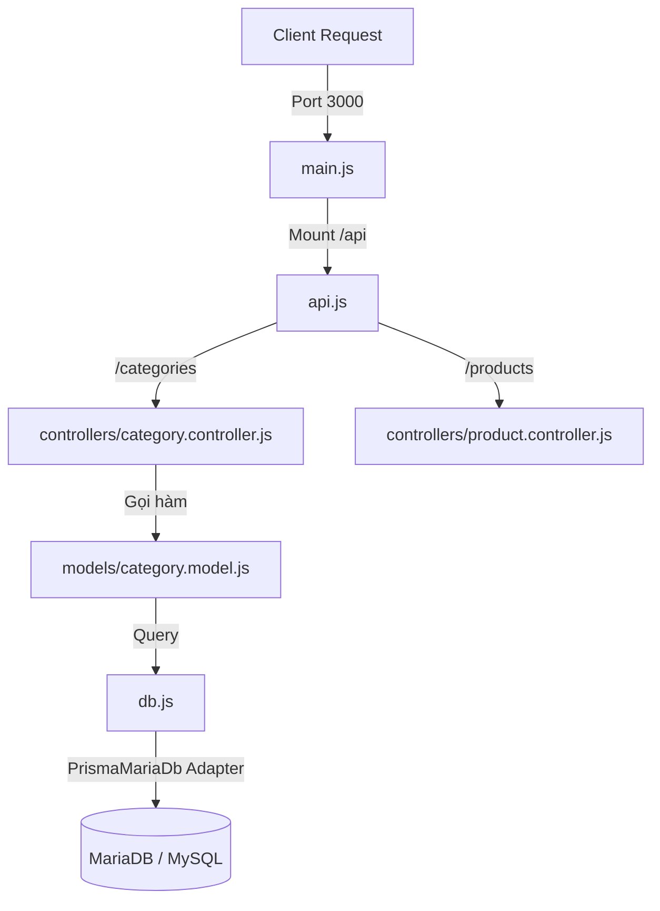

# Project Backend API - Cấu trúc hiện tại (Category & Product)

Tài liệu này mô tả chi tiết cấu trúc thư mục, kiến trúc phân tầng, kết nối cơ sở dữ liệu và các API hiện tại của dự án.

---

## 1. Cấu trúc Thư mục Hiện tại
Dưới đây là sơ đồ cây thư mục thực tế của dự án:

```text
SRS/
├── prisma/
│   ├── schema.prisma          # Schema mẫu cho Task Management (chưa sử dụng)
│   └── seed.js                # Dữ liệu mẫu (seeder) cho Task Management
├── generated/                 # Thư mục chứa Prisma Client được build riêng
│   ├── schema.prisma          # Schema thực tế cho Category & Product
│   └── client.js              # Prisma Client export
├── controllers/               # Xử lý Request & Response (Routing Logic)
│   ├── category.controller.js # API quản lý Category
│   └── product.controller.js  # API quản lý Product
├── models/                    # Tầng giao tiếp Database (Data Access Layer)
│   └── category.model.js      # Các hàm truy vấn bảng Category
├── .env                       # Biến môi trường
├── api.js                     # Bộ định tuyến trung gian (Middle Router)
├── db.js                      # Cấu hình kết nối Database bằng Prisma MariaDB adapter
├── main.js                    # Entry point - Khởi tạo Express Server
├── package.json               # Quản lý thư viện và script chạy dự án
└── README.md                  # Hướng dẫn này
```

---

## 2. Thiết kế API & Luồng xử lý
Dự án được xây dựng theo mô hình **MVC** rút gọn (Model - Controller - Route), sử dụng Express.js:



### Các Endpoint hiện có:
#### 1. Category APIs (`/api/categories`)
* **GET `/api/categories`**: Lấy danh sách toàn bộ danh mục sản phẩm.
* **POST `/api/categories`**: Tạo danh mục mới (truyền object qua Request Body).
* **DELETE `/api/categories/:catId`**: Xóa danh mục theo ID.

#### 2. Product APIs (`/api/products`)
* **GET `/api/products`**: Lấy danh sách sản phẩm.

---

## 3. Cấu trúc Cơ sở dữ liệu thực tế
Cơ sở dữ liệu chính được định nghĩa trong file `generated/schema.prisma` gồm 2 bảng:

### Bảng `Category`
* `id` (Int, Primary Key, Autoincrement)
* `title` (String)
* `status` (Boolean)
* `products` (Quan hệ 1 - Nhiều với `Product`)

### Bảng `Product`
* `id` (Int, Primary Key, Autoincrement)
* `name` (String)
* `price` (Float)
* `category_id` (Int, Foreign Key liên kết tới `Category`)

---

## 4. Kết nối Database (`db.js`)
Không giống như Prisma Client tiêu chuẩn, dự án sử dụng adapter `@prisma/adapter-mariadb` để kết nối trực tiếp với MariaDB. Cấu hình kết nối hiện tại trong [db.js](file:///c:/User/Dev/Practice/Module%204/SRS/db.js):

* **Host**: `localhost`
* **Port**: `3306`
* **User**: `root`
* **Password**: `""` (Trống)
* **Database**: `test_express_db`

> [!WARNING]
> Cấu hình trong `db.js` hiện tại đang hardcode thông tin kết nối và database `test_express_db`, không đọc từ file `.env`. Hãy đảm bảo cơ sở dữ liệu `test_express_db` đã tồn tại trên MariaDB của bạn trước khi chạy.

---

## 5. Hướng dẫn Chạy Dự án

### Bước 1: Cài đặt Thư viện
Mở terminal tại thư mục gốc của dự án và chạy:
```bash
npm install
```

### Bước 2: Chuẩn bị Database
Tạo cơ sở dữ liệu tên là `test_express_db` trên MySQL/MariaDB client của bạn (ví dụ qua phpMyAdmin, DBeaver hoặc CLI).

### Bước 3: Khởi động Server
Hiện tại, script `"dev"` trong `package.json` đang cấu hình chạy `"nodemon src/app.js"` (lỗi thời do cấu hình cũ). Để chạy dự án đúng với cấu trúc hiện tại, bạn có hai cách:

* **Cách 1: Chạy trực tiếp qua Node/Nodemon**
  ```bash
  npx nodemon main.js
  ```
* **Cách 2: Cập nhật lại script trong `package.json`**
  Thay thế dòng:
  ```json
  "dev": "nodemon src/app.js"
  ```
  thành:
  ```json
  "dev": "nodemon main.js"
  ```
  Sau đó chạy bằng lệnh:
  ```bash
  npm run dev
  ```

Mặc định, server sẽ lắng nghe tại cổng **3000** (Xem chi tiết tại [main.js](file:///c:/User/Dev/Practice/Module%204/SRS/main.js)). Bạn có thể kiểm tra danh sách category tại:
`http://localhost:3000/api/categories`